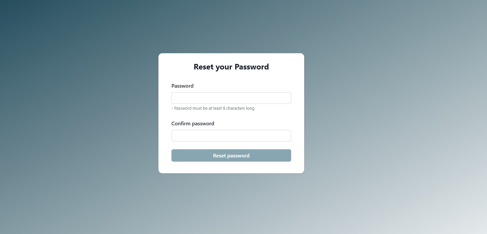

# MERN Auth Workflow

This project is a MERN (MongoDB, Express, React, Node.js) authentication workflow. It includes a client-side application built with React and a server-side application built with Express. The project provides user authentication features such as registration, login, email verification, password reset, and more.

## Features

- User registration
- User login
- Password reset
- send emails for account verification and password reset
- Token-based authentication for secure API access.

## Technologies Used

### Frontend

- **React**
- **Tailwind**

### Backend

- **Node.js**
- **Express**
- **MongoDB**
- **JWT**

with `Typescript` for type 

## Screenshots

### Login page


### Register Page


###  Forgot password page


###  Reset password page


###  Home page


## Getting Started

### Prerequisites

- Node.js (v16 or higher)
- MongoDB

### Installation

1. Clone the repository:

```sh
git clone https://github.com/salahghr4/mern-auth-workflow.git
cd mern-auth-workflow
```

2. Install dependencies for the client:

```sh
cd client
npm install
```

3. Install dependencies for the server:

```sh
cd ../server
npm install
```

### Configuration

1. Create a `.env` file in the **server** directory based on the `.env.template` file and fill in the required environment variables.

2. Create a `.env` file in the **client** directory and add the following environment variable:

```
VITE_API_URL=http://localhost:3000/api/v1
```

### Running the Application

- Start the server:

```sh
cd server
npm run dev
```

- Start the client:

```sh
cd ../client
npm run dev
```

- The client application should now be running at http://localhost:5173 and the server at http://localhost:3000.

## API Endpoints

### Register user

- `POST /api/v1/auth/register`

  <table border=1 style="width: 60%;">
    <tr>
      <th>parameter</th>
      <th>type</th>
    </tr>
    <tr>
      <td>username</td>
      <td>string</td>
    </tr>
    <tr>
      <td>email</td>
      <td>string</td>
    </tr>
    <tr>
      <td>password</td>
      <td>string</td>
    </tr>
    <tr>
      <td>confirmPassword</td>
      <td>string</td>
    </tr>
  </table>

### Login user

- `POST /api/v1/auth/login`

  <table border=1 style="width: 60%;">
    <tr>
      <th>parameter</th>
      <th>type</th>
    </tr>
    <tr>
      <td>email</td>
      <td>string</td>
    </tr>
    <tr>
      <td>password</td>
      <td>string</td>
    </tr>
  </table>

### Logout user

- ` POST /api/v1/auth/logout`

### Verify user's email

- `PATCH /api/v1/email/verify/:code`

  <table border=1 style="width: 60%">
    <tr>
      <th>parameter</th>
      <th>type</th>
    </tr>
    <tr>
      <td>code (a code generated for email verification)</td>
      <td>url parameter</td>
    </tr>
  </table>

### Forgot password
- `POST /api/v1/password/forgot`

  <table border=1 style="width: 60%">
    <tr>
      <th>parameter</th>
      <th>type</th>
    </tr>
    <tr>
      <td>email</td>
      <td>string</td>
    </tr>
  </table>

### Reset password
- `POST /api/v1/password/forgot`

  <table border=1 style="width: 60%">
    <tr>
      <th>parameter</th>
      <th>type</th>
    </tr>
    <tr>
      <td>password</td>
      <td>string</td>
    </tr>
    <tr>
      <td>verificationCode (a code to verify the request generated on forgot password request)</td>
      <td>string</td>
    </tr>
  </table>


### Refresh Token
- `GET /api/v1/auth/refresh-token`

  <table border=1 style="width: 60%">
    <tr>
      <th>parameter</th>
      <th>type</th>
    </tr>
    <tr>
      <td>refreshToken</td>
      <td>cookie (string)</td>
    </tr>
  </table>

### Get user
- `GET /api/v1/user/`  (require Authorization header contain the Bearer Token on the request)

## Contributing

Contributions are welcome! Please fork the repository, make your changes, and submit a pull request.
